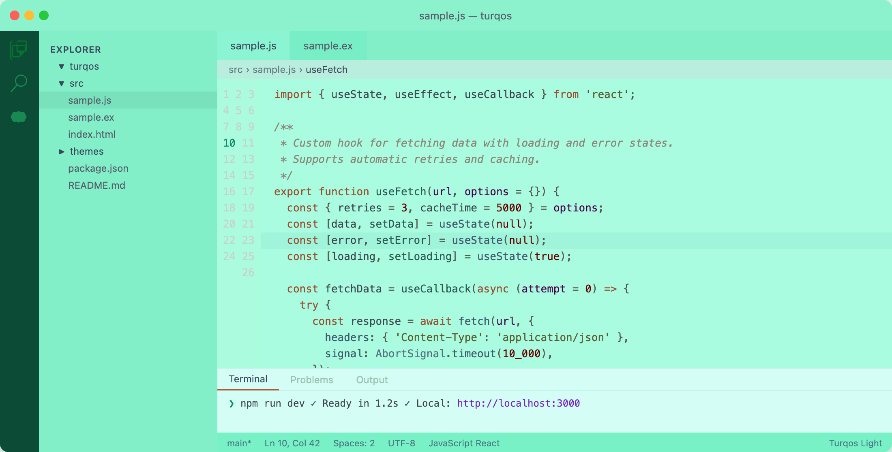

# Turqos Light

A turquoise and mint light theme for VS Code with warm syntax colors.

## Features

- **Turquoise/mint UI** — sidebar, tabs, title bar in cohesive mint tones
- **Warm syntax colors** — earthy browns, teals, and plums for readable code
- **Tuned opacity** — no content bleed-through on scroll
- **Teal highlights** — selections, word highlights, bracket matches all mint-aligned
- **GitLens-aware** — tuned annotation colors for mint backgrounds

## Installation

1. Open VS Code
2. Press `Cmd+Shift+X` to open Extensions
3. Search for **Turqos Light**
4. Click Install
5. Press `Cmd+K Cmd+T` and select **Turqos Light**

## Also available

- [Turqos Dark](https://marketplace.visualstudio.com/items?itemName=turqos.turqos-dark) — a deep matrix-green dark theme

## Feedback

Found a bug or want a tweak? [Open an issue](https://github.com/gondwe/turqos/issues).
