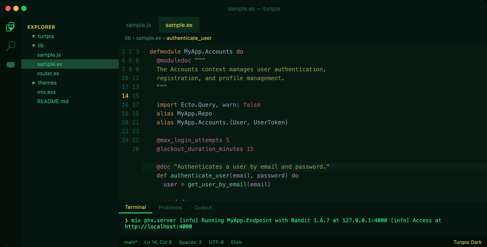

# Turqos Dark

A deep matrix-green dark theme for VS Code with yellow and green accents.

## Features

- **Deep dark backgrounds** — editor, sidebar, terminal all in black-green tones
- **Yellow accents** — cursor, active line number, active tab, badges, find matches
- **Green accents** — terminal text, progress bar, activity bar, links
- **Punchy ANSI terminal colors** — matrix-inspired palette
- **GitLens-aware** — tuned annotation colors for readability

## Installation

1. Open VS Code
2. Press `Cmd+Shift+X` to open Extensions
3. Search for **Turqos Dark**
4. Click Install
5. Press `Cmd+K Cmd+T` and select **Turqos Dark**

## Also available

- [Turqos Light](https://marketplace.visualstudio.com/items?itemName=turqos.turqos-lite) — a turquoise/mint light theme

## Feedback

Found a bug or want a tweak? [Open an issue](https://github.com/gondwe/turqos/issues).
